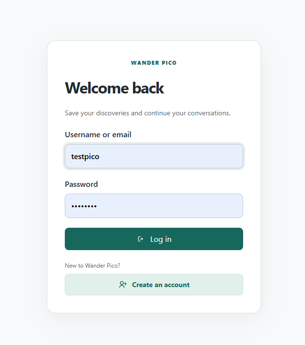
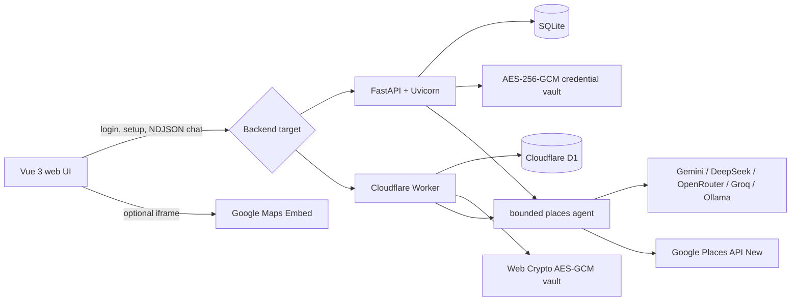

<a id="top"></a>

# Wander Pico

**Try the live app online: [pico.parasyst.it.com](https://pico.parasyst.it.com)**

**Find places worth visiting. See the evidence. Keep exploring.**

[Get started](#quick-start) · [Screenshot tour](#screenshot-tour) · [Why build from scratch?](#why-build-from-scratch-instead-of-open-webui) · [Documentation menu](#documentation-menu)

[](docs/images/darkmode%20desktop.png)

*Local discovery with live place data, your choice of AI, and a purpose-built interface. Select any screenshot to view it at full size.*

> A small, production-shaped local discovery agent: choose an AI provider, ask for a place,
> and get grounded recommendations with live Google data, photos, maps, and saved chat history.

Wander Pico is a demo application for experimenting with agentic chat without a long setup
checklist. The first login on a local deployment opens a guided setup screen that detects
existing `.env` credentials, discovers a running Ollama installation, tests the chosen AI
model, validates Google Places, and takes the user directly into the chat.

The same Vue frontend can run against either the Python/FastAPI backend or the included
Cloudflare Worker. The local Python app is the full first-run experience and stores its data
in SQLite. The Worker uses D1 and is intended for a hosted demo.

## Documentation menu

Choose a path below, or expand the screenshot tour to see the app before installing it.
Detailed reference tables are expandable to keep this page easy to scan.

| I want to… | Go to |
|---|---|
| Understand the project | [Features](#what-it-does) · [Why build from scratch?](#why-build-from-scratch-instead-of-open-webui) · [Screenshot tour](#screenshot-tour) |
| Run it locally | [Quick start](#quick-start) · [First-run setup](#first-run-setup-behavior) · [Docker / Open WebUI](#docker-and-open-webui) |
| Connect AI and maps | [AI providers](#ai-providers) · [Google Maps setup](#google-maps-platform-setup) · [Configuration](#configuration-reference) |
| Understand or change the code | [Architecture](#architecture) · [Repository map](#repository-map) · [Technology](#technology-and-dependencies) · [Development](#development-workflow) · [Testing](#testing) |
| Deploy a demo | [Cloudflare](#cloudflare-deployment) · [Render](#render-deployment) |
| Integrate or operate it | [API](#api-overview) · [Persistence and encryption](#persistence-and-encryption) · [Security](#security-model) |
| Solve a problem or learn more | [Troubleshooting](#troubleshooting) · [Cost and data](#cost-and-data-notes) · [References](#useful-references) · [License](#license) |

[↑ Back to menu](#documentation-menu) · [Back to top](#top)

## Why build from scratch instead of Open WebUI?

Wander Pico uses a custom frontend and agent backend because the product is a **local
place-discovery experience**. The goal is to own the journey from connecting a model to
comparing real places, opening a map, and continuing a saved conversation.

| Project priority | Why a custom implementation fits |
|---|---|
| A place-first interface | Recommendations become cards with photos, ratings, addresses, and map actions, with a dedicated map modal and mobile layout. |
| Guided setup | The local first-run flow detects credentials, discovers Ollama models, tests the selected AI, and verifies Google Places before the first chat. |
| Control over the agent | The backend owns the bounded search/details/finish loop, validates place IDs, and streams progress alongside structured results. |
| Control over the whole experience | Provider settings, account-scoped keys, saved rich results, themes, and follow-up suggestions can evolve together. |
| Two deployment paths | The same Vue interface targets a local FastAPI/SQLite app or a hosted Cloudflare Worker/D1 backend. |

Building this way also makes the implementation inspectable end to end: the UI, tool loop,
provider adapters, storage, and deployment code all live in this repository. “From scratch”
here means building the application around these needs using Vue, FastAPI, and other existing
libraries—not reimplementing those foundations.

**The tradeoff is maintenance.** This project must maintain its own authentication, chat UI,
accessibility, provider integrations, security controls, and tests. Reusing an existing chat
interface can reduce the amount of application code to own when a custom discovery flow is
not the priority.

**Open WebUI remains an optional client.** The repository includes an OpenAI-compatible
`/v1` adapter and a Docker Compose profile for it. Use the built-in UI for the experience
shown here, or follow [Docker and Open WebUI](#docker-and-open-webui) to connect that client.
The custom UI is a product choice, not a claim that Open WebUI cannot be extended.

[↑ Back to menu](#documentation-menu) · [Back to top](#top)

## Screenshot tour

The desktop overview is shown above. Expand a step below, then select its image for the
full-size view. These are captured examples; available models and live place results vary.

<details>
<summary><strong>1. Sign in and resume your discoveries</strong></summary>

Sign in to keep discoveries and conversations connected to your account.

[](docs/images/login.png)

</details>

<details>
<summary><strong>2. Connect a model with guided onboarding</strong></summary>

Choose your AI, connect Google Places, and verify the setup before chatting. [Setup details](#first-run-setup-behavior).

[](docs/images/onboard%20setup.png)

</details>

<details>
<summary><strong>3. Choose your AI provider</strong></summary>

Switch providers and configure the optional Ollama fallback. [Provider reference](#ai-providers).

[](docs/images/ai%20choices.png)

</details>

<details>
<summary><strong>4. Explore a place on the map</strong></summary>

Inspect a recommended place without leaving the conversation, or open it in Google Maps.

[](docs/images/maps%20modal.png)

</details>

<details>
<summary><strong>5. Continue on mobile in light mode</strong></summary>

The narrow layout keeps place cards, follow-up prompts, and chat within reach.

<a href="docs/images/mobile%20light%20mode.png"></a>

</details>

[↑ Back to menu](#documentation-menu) · [Back to top](#top)

## What it does

- Supports Google Gemini, DeepSeek, OpenRouter, FreeRouter, Groq, and local Ollama.
- Runs a bounded model-directed tool loop instead of a fixed search template.
- Searches Google Places, inspects relevant place details, and asks the model to compare
  evidence before recommending anything.
- Streams status, tool activity, optional model reasoning, answer text, place cards, and
  follow-up suggestions to the browser.
- Shows ratings, review counts, addresses, Google-hosted photos, direct Maps links, and an
  optional embedded map.
- Saves accounts, sessions, chat history, rich message results, and encrypted provider keys.
- Includes an OpenAI-compatible `/v1` adapter for Open WebUI and similar clients.
- Ships with responsive light/dark UI and Playwright coverage for desktop and mobile.

[↑ Back to menu](#documentation-menu) · [Back to top](#top)

## Quick start

### Requirements

- Python 3.11 or newer
- A Google Places API key for live place recommendations
- One AI option:
  - Ollama running locally with a chat model, or
  - an API key for Gemini, DeepSeek, OpenRouter, or Groq
- Node.js 20+ only if you plan to edit or rebuild the frontend

### 1. Create the local environment

```powershell
Copy-Item .env.example .env
python -m venv .venv
.\.venv\Scripts\Activate.ps1
pip install -r requirements.txt
```

You may paste keys into `.env` before starting, but you do not have to. The local setup guide
can securely save a missing Google key and account-scoped AI provider key for you.

### 2. Optional: prepare Ollama

```powershell
ollama pull qwen3.5:9b
```

Keep Ollama running at `http://localhost:11434`. If you use Docker, Compose automatically
points the backend at `host.docker.internal:11434`.

### 3. Start the app

```powershell
uvicorn app.main:app --host 127.0.0.1 --port 8001
```

Open [http://localhost:8001](http://localhost:8001). You can use either account option:

| Option | How to sign in |
|---|---|
| **Try the seeded demo user** | Log in with username **`testpico`** and password **`testpico`**. The local backend creates this account automatically; no registration is needed. |
| **Create your own account** | Select **Create an account** on the login screen, enter your username, email, and password, then submit the form. For later logins, use your username or email and password. |

A new account has its own conversations and saved provider keys. First-run connection setup
is shared by the local instance, so creating another account does not reset completed setup.

The first-run guide opens automatically. Choose an AI provider, test it, verify Google
Places, and select **Finish & start chatting**. The guide is marked complete for this local
instance and will not interrupt future logins. It remains available from **Setup &
connections** in the sidebar.

> The seeded account is intentionally convenient for a local demo. Do not expose it to the
> internet unchanged. Create a new account and remove or disable the seed before treating the
> project as a real service.

[↑ Back to menu](#documentation-menu) · [Back to top](#top)

## First-run setup behavior

The setup guide is available only when the site is opened with a localhost hostname. Its
write endpoints still require a valid app login.

1. **Choose your AI** — configured server keys are detected without being returned to the
   browser. Ollama is enabled only when the backend can reach it, and installed chat-capable
   models are loaded into a picker.
2. **Connect Google** — an existing `GOOGLE_PLACES_API_KEY` is detected. If it is missing, the
   guide accepts it and stores it encrypted. `GOOGLE_MAPS_EMBED_API_KEY` is optional.
3. **Verify and finish** — the selected AI must return the structured format used by the
   agent, and Google Places must accept a minimal live search request. Completion is persisted
   in SQLite.

Keys typed into the setup UI are submitted directly to the backend. They are never written to
`localStorage`, included in chat history, or returned by configuration endpoints.

[↑ Back to menu](#documentation-menu) · [Back to top](#top)

## AI providers

| Provider | Default model | Credential | Notes |
|---|---|---|---|
| Google Gemini | `gemini-flash-latest` | `GEMINI_API_KEY` | Uses Google's OpenAI-compatible endpoint for request-scoped provider selection. |
| DeepSeek | `deepseek-v4-flash` | `DEEPSEEK_API_KEY` | Default hosted Worker provider. |
| OpenRouter | `openrouter/free` | `OPENROUTER_API_KEY` | Free routes still require an account key and have provider-specific limits. |
| FreeRouter | `auto` | `FREEROUTER_BASE_URL` | Self-hosted OpenAI-compatible gateway; defaults to `http://localhost:18800/v1` and needs a key only when the gateway is secured. |
| Groq | `llama-3.3-70b-versatile` | `GROQ_API_KEY` | Uses the OpenAI-compatible Groq endpoint. |
| Ollama | `qwen3.5:9b` | None | Runs on the backend host; the selected model must be installed and support chat. |

Open **AI settings** at any time to switch provider or model, load a cloud model catalog, save
or replace a personal key, or enable Ollama as a pre-output fallback. Model choices are stored
in the browser; provider keys are encrypted on the backend and scoped to the signed-in user.

Fallback is deliberately conservative: it retries a failed cloud model step on Ollama only
before answer or reasoning output has started. It never silently switches after a partial
answer and never sends data to an arbitrary client-provided endpoint.

[↑ Back to menu](#documentation-menu) · [Back to top](#top)

## Google Maps Platform setup

The app needs only **Places API (New)** for its core experience. **Maps Embed API** is optional.

| Variable | Enable | Restriction | Exposure |
|---|---|---|---|
| `GOOGLE_PLACES_API_KEY` | Places API (New) | Backend outbound IP address | Private; sent in an HTTPS header only |
| `GOOGLE_MAPS_EMBED_API_KEY` | Maps Embed API | Exact website referrers | Browser-visible by Google API design |

Recommended Google Cloud steps:

1. Create or select a dedicated Google Cloud project and attach billing.
2. Enable **Places API (New)**.
3. Create a key named `places-backend`, restrict it to Places API (New), and apply an IP
   restriction matching the backend's public outbound address.
4. Set conservative per-minute quotas and create billing budget alerts.
5. Optional: enable Maps Embed API and create a separate website-restricted key. For local
   work allow `http://localhost:8001/*` and `http://127.0.0.1:8001/*`.

Do not reuse the private Places key as the browser-visible Embed key. The app does not need
Maps JavaScript API, Routes API, Directions API (Legacy), or Geocoding API.

[↑ Back to menu](#documentation-menu) · [Back to top](#top)

## Architecture



### Request lifecycle

1. The browser authenticates and creates or resumes an owned conversation.
2. `/api/chat/stream` resolves the selected provider and its account-scoped key.
3. The model returns one JSON action: `search`, `details`, or `finish`.
4. The backend validates and executes the action. Unknown place IDs, duplicate actions, and
   more than eight tool operations are rejected or bounded.
5. Tool results become observations for the next model step. External data is treated as
   untrusted content, never as instructions.
6. The final grounded answer and structured place data stream to the UI and are saved to the
   authenticated conversation.

### Repository map

```text
app/
  main.py                FastAPI routes, middleware, startup, local setup API
  service.py             bounded search/details/finish agent loop
  providers.py           request-scoped cloud provider adapters and fallback
  ollama.py              native Ollama transport and model discovery
  gemini.py              native Gemini behavior shared by provider clients
  google_maps.py         Places search, details, photos, embed URLs, live test
  accounts.py            users, sessions, ownership, saved credentials/settings
  provider_vault.py      AES-GCM encryption for user and instance secrets
  history.py             SQLite conversation/message persistence
  static/                 production browser assets served by FastAPI
frontend/
  App.vue                 application shell
  SetupWizard.vue         local first-run setup experience
  AISettings.vue          provider/model/key management after setup
  WelcomeScreen.vue       initial prompts
worker/
  index.js                Cloudflare HTTP API and Google integration
  agent.js                Worker version of the bounded agent loop
  auth.js                 D1 account/session operations
  providers.js            Worker provider catalog adapter
migrations/               D1 schema migrations
scripts/
  build-site.mjs          static hosted-site output builder
  smoke_providers.py      credential-safe live integration smoke test
tests/                    Python, Worker, streaming, and Playwright tests
```

[↑ Back to menu](#documentation-menu) · [Back to top](#top)

## Technology and dependencies

<details>
<summary>Expand libraries, versions, and their roles</summary>

### Backend

| Library | Version range | Role |
|---|---:|---|
| FastAPI | `>=0.116,<1` | HTTP API, validation, OpenAPI docs, middleware |
| Uvicorn | `>=0.35,<1` | ASGI development/production server |
| HTTPX | `>=0.28,<1` | async calls to AI providers and Google APIs |
| Pydantic Settings | `>=2.10,<3` | typed `.env` configuration |
| Google Gen AI SDK | `>=1.0,<2` | native Gemini client used by the default backend path |
| cryptography | `>=46,<51` | AES-256-GCM encryption for saved keys |
| SQLite | Python standard library | accounts, sessions, chats, setup state, encrypted values |

Development dependencies are `pytest`, `pytest-asyncio`, `respx`, and `ruff`; see
`requirements-dev.txt` for the pinned ranges.

### Frontend and hosted backend

| Package | Role |
|---|---|
| Vue 3 | component UI and reactive provider/setup state |
| Vite | bundles Vue source into `app/static/` |
| Playwright | real-browser responsive and interaction tests |
| Wrangler | Cloudflare Worker development, D1 migrations, deployment |
| Cloudflare D1 | hosted account, session, chat, and encrypted provider-key storage |
| Web Crypto API | AES-GCM encryption in the Worker runtime |

The Python Docker image serves prebuilt frontend assets, so Node.js is not required at runtime.

</details>

[↑ Back to menu](#documentation-menu) · [Back to top](#top)

## Configuration reference

<details>
<summary>Expand environment variables and defaults</summary>

Copy `.env.example` to `.env`. Empty optional values are valid.

| Variable | Default | Purpose |
|---|---|---|
| `AI_PROVIDER` | `ollama` | shared backend default when the browser has no selection |
| `OLLAMA_BASE_URL` | `http://localhost:11434` | Ollama server, without `/v1` |
| `OLLAMA_MODEL` | `qwen3.5:9b` | default local chat model |
| `OLLAMA_CONTEXT_LENGTH` | `8192` | Ollama context window requested by the app |
| `OLLAMA_REQUEST_TIMEOUT_SECONDS` | `120` | local generation timeout |
| `GEMINI_API_KEY` | empty | shared Gemini key |
| `GEMINI_MODEL` | `gemini-flash-latest` | Gemini model used by default |
| `DEEPSEEK_API_KEY` | empty | shared DeepSeek key |
| `DEEPSEEK_MODEL` | `deepseek-v4-flash` | DeepSeek model used by default |
| `OPENROUTER_API_KEY` | empty | shared OpenRouter key |
| `OPENROUTER_MODEL` | `openrouter/free` | OpenRouter route or exact model |
| `GROQ_API_KEY` | empty | shared Groq key |
| `GROQ_MODEL` | `llama-3.3-70b-versatile` | Groq model used by default |
| `GOOGLE_PLACES_API_KEY` | empty | private Places API (New) key |
| `GOOGLE_MAPS_EMBED_API_KEY` | empty | optional website-restricted Embed key |
| `GOOGLE_REQUEST_TIMEOUT_SECONDS` | `25` | Google request timeout |
| `MAX_PLACE_RESULTS` | `5` | bounded results returned per search, from 1 to 10 |
| `HISTORY_DATABASE_PATH` | `data/wanderai.sqlite3` | persistent SQLite location |
| `PROVIDER_ENCRYPTION_KEY` | generated locally | optional base64-encoded 32-byte vault key |
| `APP_API_KEY` | empty | optional protection for OpenAI-compatible `/v1` routes |
| `API_MODEL_NAME` | `qwen3.5:9b-maps` | model name advertised by `/v1/models` |
| `CORS_ORIGINS` | local origins | comma-separated allowed browser origins |
| `TRUSTED_HOSTS` | local hosts | comma-separated accepted Host headers |
| `RATE_LIMIT_REQUESTS` | `30` | in-process requests per window |
| `RATE_LIMIT_WINDOW_SECONDS` | `60` | limiter window in seconds |

An account-scoped key saved from the UI takes precedence over a shared `.env` key for that
provider. A blank personal key falls back to the server value.

</details>

[↑ Back to menu](#documentation-menu) · [Back to top](#top)

## Development workflow

Install both dependency sets:

```powershell
pip install -r requirements.txt -r requirements-dev.txt
npm ci
```

Run the backend:

```powershell
uvicorn app.main:app --reload --host 127.0.0.1 --port 8001
```

After editing Vue files, rebuild the assets served by FastAPI:

```powershell
npm run build:ui
```

`frontend/` contains source code. `app/static/ui.js` and `app/static/ui-*.js` are generated
artifacts. `app/static/app.js` is the browser controller for authentication, conversations,
stream processing, maps, and dynamically rendered result cards.

[↑ Back to menu](#documentation-menu) · [Back to top](#top)

## Testing

The automated suites cover individual functions, backend integration behavior, and browser
interactions. External AI and Google responses are mocked in these suites. The optional live
smoke check is separate and makes real requests.

### Test scope

| Layer | Test files | What is covered |
|---|---|---|
| Python agent and streaming | `tests/test_service_stream.py` | Search/details/finish flow, conversation context, unknown place IDs, repeated actions, tool-error recovery, and JSON/stream response contracts. |
| Python AI adapters | `tests/test_providers.py`, `tests/test_ollama.py`, `tests/test_gemini.py` | Provider routing, model catalogs, request-scoped model choices, missing credentials, stream failures, fallback before output, Ollama discovery, and separation of reasoning from answer text. |
| Google Places adapter | `tests/test_google_maps.py` | Minimal connection checks, field masks and result bounds, optional embed keys, photo resolution, invalid photo paths, and sanitized upstream failures. |
| Accounts, history, and credentials | `tests/test_accounts.py`, `tests/test_history.py`, `tests/test_provider_keys.py` | Seeded login, registration, duplicate accounts, conversation ownership, persistence across restarts, rich results, encrypted keys, and account isolation. These include API/SQLite integration tests. |
| Local setup and API protections | `tests/test_setup.py`, `tests/test_security.py`, `tests/test_docs.py` | Encrypted setup storage and completion, localhost restrictions, rate limiting, documentation content-security policies, and OpenAPI authentication declarations. |
| Worker agent and streams | `tests/worker-agent.test.mjs`, `tests/worker-stream.test.mjs` | Tool selection and bounds, safe tool errors, partial JSON/Unicode parsing, progress before completion, and final-answer persistence. |
| Worker providers and Google photos | `tests/worker-providers.test.mjs`, `tests/worker-ollama-settings.test.mjs`, `tests/worker-photos.test.mjs` | Provider/model/credential isolation, fallback rules, Ollama model discovery, and photo lookup through Place Details. |
| Worker accounts, keys, and docs | `tests/worker-accounts.test.mjs`, `tests/worker-provider-keys.test.mjs`, `tests/worker-docs.test.mjs` | Ownership, migration behavior, persistence, logout, encrypted key replacement/removal, and OpenAPI/docs responses using local test doubles. |
| Browser stream parser | `tests/chat-stream.test.mjs` | Split UTF-8 chunks, final events without trailing newlines, interrupted streams, and error events. Runs under Node without opening a browser. |
| Browser UI | `tests/ui/interface.spec.mjs` | Guided setup, login/logout and registration mode, suggestions, chat switching/search, streamed responses, mobile navigation, themes, map dialogs, AI settings, and Ollama model selection. Runs in Chromium with mocked API routes. |

These checks do not establish a coverage percentage or verify a deployed Cloudflare/Render
service. Browser tests exercise the real frontend against mocked responses rather than a live
backend. The live smoke check validates configured connections, not the complete browser-to-
production journey.

### Prepare the test environment

Run commands from the repository root with your Python virtual environment activated:

```powershell
pip install -r requirements.txt -r requirements-dev.txt
npm ci
npx playwright install chromium
```

### Run Python unit and integration tests

```powershell
python -m pytest -q
```

To focus on one area, pass a file or select tests by name:

```powershell
python -m pytest -q tests/test_google_maps.py
python -m pytest -q tests/test_providers.py -k fallback
```

### Run Worker and browser-parser tests

This command includes both the Worker suites and `chat-stream.test.mjs`:

```powershell
node --test tests/*.test.mjs
```

To run only the Worker agent tests:

```powershell
node --test tests/worker-agent.test.mjs
```

### Run browser interaction tests

Build the frontend first so the tests exercise your latest Vue changes:

```powershell
npm run build:ui
npm run test:ui
```

Playwright starts the static test server on `http://127.0.0.1:4173` automatically. You do not
need to start FastAPI or configure live provider keys for this suite. Screenshots and failure
artifacts are written under `test-results/`.

For a visible browser or a single scenario:

```powershell
npm run test:ui -- --headed
npm run test:ui -- --grep "mobile navigation"
```

### Optional: check real AI and Google connections

Configure the relevant server credentials in `.env` and start Ollama if you want to check the
local model, then run:

```powershell
python -m scripts.smoke_providers
```

This checks structured agent responses from configured AI providers and a minimal Google
Places request. It reports `PASS`, `FAIL`, or `SKIP`; missing provider keys and an unavailable
Ollama service are skipped. It reads server settings, so it does not test personal keys saved
only through the UI. Real requests can consume provider and Google quota.

[↑ Back to menu](#documentation-menu) · [Back to top](#top)

## Docker and Open WebUI

Start the API and built-in web app:

```powershell
docker compose up -d --build maps-api
```

Open [http://localhost:8001](http://localhost:8001). SQLite data and the generated encryption
key live in the `wanderai-data` volume.

To also run Open WebUI:

```powershell
docker compose --profile open-webui up -d --build
```

In Open WebUI, add an OpenAI-compatible connection:

- URL inside Compose: `http://maps-api:8001/v1`
- URL from another local container: `http://host.docker.internal:8001/v1`
- API key: the configured `APP_API_KEY`
- Model: the value of `API_MODEL_NAME`

[↑ Back to menu](#documentation-menu) · [Back to top](#top)

## Cloudflare deployment

The Worker mirrors authentication, provider selection, streaming, Google place lookup, and
saved chats. The local first-run secret writer is intentionally not available in the Worker;
configure hosted secrets with Wrangler.

```powershell
npm ci
npm run db:migrate
npm run deploy
```

Set secrets before deployment:

```powershell
npx wrangler secret put DEEPSEEK_API_KEY
npx wrangler secret put GOOGLE_PLACES_API_KEY
npx wrangler secret put GOOGLE_MAPS_EMBED_API_KEY
npx wrangler secret put PROVIDER_ENCRYPTION_KEY
```

Then build the static site:

```powershell
npm run build:site
```

`site-dist/` contains the frontend configured for the Worker API. The build does not publish
it automatically. Update `APP_ORIGIN`, Worker URLs, CORS policy, and trusted deployment values
for your own domain.

[↑ Back to menu](#documentation-menu) · [Back to top](#top)

## Render deployment

`render.yaml` defines a Docker web service with a persistent disk for SQLite. Create the
service from the blueprint, provide the secret environment variables in Render, and point
`CORS_ORIGINS` and `TRUSTED_HOSTS` at the real frontend/API hosts. The first-run writer is
localhost-only, so hosted credentials belong in Render's secret configuration.

[↑ Back to menu](#documentation-menu) · [Back to top](#top)

## API overview

<details>
<summary>Expand API routes and streaming formats</summary>

Interactive OpenAPI documentation is available at
[http://localhost:8001/docs](http://localhost:8001/docs).

| Method | Path | Purpose |
|---|---|---|
| `GET` | `/health` | provider and Google configuration health without secrets |
| `GET` | `/api/config` | public browser capabilities, including local setup availability |
| `POST` | `/api/auth/register` | create an account |
| `POST` | `/api/auth/login` | create an eight-hour in-memory browser session |
| `POST` | `/api/auth/logout` | revoke the current session |
| `GET/POST` | `/api/conversations` | list or create owned chats |
| `GET` | `/api/conversations/{id}` | load one owned chat |
| `POST` | `/api/chat` | complete JSON agent response |
| `POST` | `/api/chat/stream` | newline-delimited status/tool/reasoning/delta/done events |
| `GET` | `/api/providers` | provider/model/configured flags; never key values |
| `POST` | `/api/providers/models` | discover models for the selected provider |
| `POST` | `/api/providers/test` | validate a provider/model using the real structured mode |
| `POST` | `/api/providers/key` | save, replace, or remove an account-scoped provider key |
| `GET/POST` | `/api/setup` | localhost-only first-run status and encrypted Google setup |
| `POST` | `/api/setup/google/test` | minimal live Google Places validation |
| `POST` | `/api/places/search` | direct bounded Places Text Search |
| `POST` | `/api/places/photo` | resolve a Places photo reference to a Google URL |
| `GET` | `/v1/models` | OpenAI-compatible model catalog |
| `POST` | `/v1/chat/completions` | OpenAI-compatible assistant endpoint |

The streaming endpoint uses NDJSON rather than Server-Sent Events. The `/v1` compatibility
endpoint uses standard OpenAI-style JSON/SSE responses.

</details>

[↑ Back to menu](#documentation-menu) · [Back to top](#top)

## Persistence and encryption

The local database defaults to `data/wanderai.sqlite3`. It stores:

- users and salted PBKDF2 password hashes;
- hashed, expiring session tokens;
- conversation ownership and message history;
- structured place results and follow-up suggestions;
- encrypted account provider keys;
- encrypted instance Google credentials saved by setup;
- the first-run completion marker.

If `PROVIDER_ENCRYPTION_KEY` is unset, the app creates
`data/provider-encryption.key` with a random 32-byte key. Back up the database and this key
together. Losing or replacing the encryption key makes saved credentials unreadable. Neither
file belongs in Git.

For Cloudflare, `PROVIDER_ENCRYPTION_KEY` must be a stable base64-encoded 32-byte Worker secret.

[↑ Back to menu](#documentation-menu) · [Back to top](#top)

## Security model

- API keys are redacted from status responses, validation errors, chat payloads, browser
  storage, and history.
- Local instance credential writes are accepted only through localhost URLs and still require
  account authentication.
- Provider URLs come from a fixed catalog; clients cannot turn the backend into an arbitrary
  request proxy.
- Google Places credentials are sent in request headers, not query strings.
- The optional Embed key is treated as browser-visible and should rely on website/API
  restrictions.
- Place IDs and photo resource names are validated before being used in outbound URLs.
- Trusted-host, CORS, input-length, rate-limit, action-count, result-count, and timeout bounds
  are applied by the backend.
- Upstream error bodies are not returned to users because they can contain account or project
  details.
- The built-in rate limiter is process-local. Use a gateway, reverse proxy, or distributed
  limiter for multiple replicas.

[↑ Back to menu](#documentation-menu) · [Back to top](#top)

## Troubleshooting

### Setup does not open

- Open the app through `http://localhost:8001` or `http://127.0.0.1:8001`.
- Log in first; setup endpoints are authenticated.
- If setup was already completed, use **Setup & connections** in the sidebar.
- Restart the backend after changing Python code or `.env`.

### Ollama is not detected

- Confirm `ollama list` works on the backend machine.
- Pull at least one chat-capable model.
- For a native run use `OLLAMA_BASE_URL=http://localhost:11434`.
- For Compose use `http://host.docker.internal:11434`.
- A hosted Worker cannot reach a visitor's localhost Ollama service.

### AI key works but the model fails

- Use **Load available models** in AI settings and choose an ID returned by the provider.
- Check billing, free-tier quota, regional availability, and key restrictions.
- Retry transient `429`, `503`, and timeout failures.
- Run `python -m scripts.smoke_providers` for a credential-safe diagnosis.

### Google Places is rejected

- Enable Places API (New), not only the legacy Places API.
- Attach billing and check quota.
- Match the private key's IP restriction to the backend's public outbound IP.
- Do not apply website-referrer restrictions to the private server key.

### Browser UI looks stale

```powershell
npm run build:ui
```

Then hard-refresh the browser. The generated frontend is served from `app/static/`.

[↑ Back to menu](#documentation-menu) · [Back to top](#top)

## Cost and data notes

AI providers and Google Maps Platform may charge for requests. The setup checks make real,
minimal requests. A place-discovery chat can make several model calls plus Google Text Search
and Place Details calls, bounded to eight tool actions per turn. Configure quotas and budgets
before sharing a public demo.

Google place cards and photo URLs are live data. Treat Google's terms, caching limits, and
attribution requirements as part of deployment readiness.

[↑ Back to menu](#documentation-menu) · [Back to top](#top)

## Useful references

- [FastAPI documentation](https://fastapi.tiangolo.com/)
- [Vue documentation](https://vuejs.org/)
- [Vite documentation](https://vite.dev/)
- [Google Places Text Search (New)](https://developers.google.com/maps/documentation/places/web-service/text-search)
- [Google Maps API security best practices](https://developers.google.com/maps/api-security-best-practices)
- [Gemini OpenAI compatibility](https://ai.google.dev/gemini-api/docs/openai)
- [DeepSeek API](https://api-docs.deepseek.com/)
- [Groq OpenAI compatibility](https://console.groq.com/docs/openai)
- [OpenRouter documentation](https://openrouter.ai/docs/)
- [Ollama API](https://docs.ollama.com/api/introduction)
- [Cloudflare Workers](https://developers.cloudflare.com/workers/)
- [Cloudflare D1](https://developers.cloudflare.com/d1/)

[↑ Back to menu](#documentation-menu) · [Back to top](#top)

## License

No license file is currently included. Add one before distributing or accepting external
contributions.

[↑ Back to menu](#documentation-menu) · [Back to top](#top)
